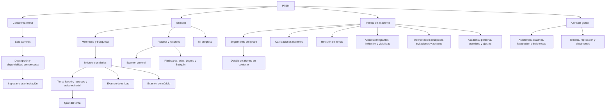
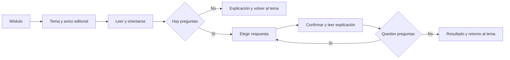
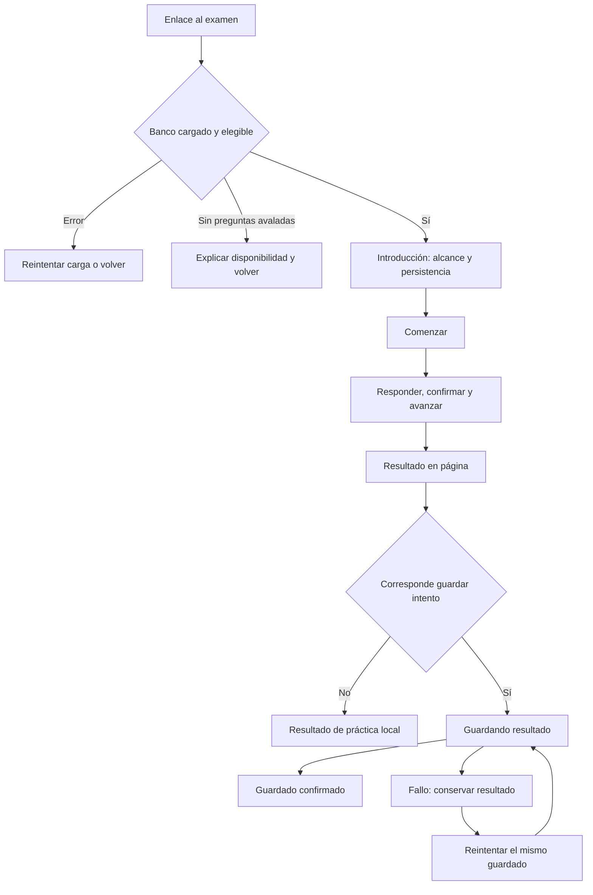
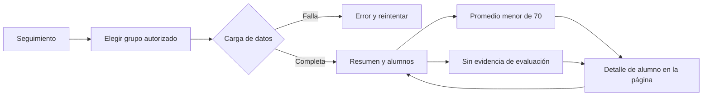
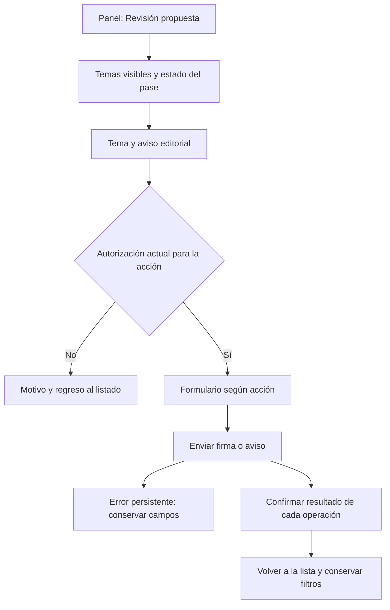
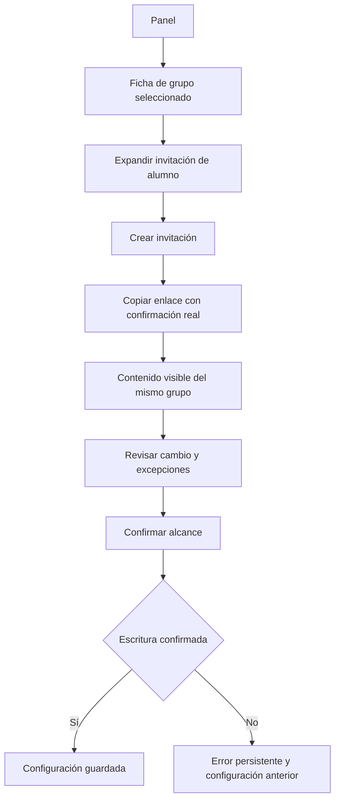

# Fase 2 — Arquitectura de información y flujos propuestos

## 1. Supuestos y estado de la entrega

«Sigue» se interpreta como continuar a Fase 2 después de la auditoría. Este documento es una propuesta revisable: ninguna navegación o función descrita como propuesta está implementada. Se conserva el árbol actual, las seis carreras públicas y Paramédicos como caso principal. Se incorpora la separación autorizada entre alumnos con promedio menor de 70 y alumnos sin evidencia de evaluación. No se cambia el umbral ni se da por decidida su interpretación en la práctica de unidad.

Los bloqueantes B01 (elegibilidad editorial en módulo/general) y B02 (quiz vacío) siguen abiertos; son condiciones de aceptación previas a entregar las experiencias de examen. Se preservan contenido académico, estados editoriales, avisos, permisos, plan Spark, HashRouter y marca. No se presupone una nueva colección, backend, rol de recepción ni permiso docente para administrar dictámenes ajenos.

La fuente de los conteos actuales es [Fase 1](FASE-1-AUDITORIA.md). Los hallazgos B01–C19 citados aquí tienen sus archivos y evidencia allí. Las rutas se contrastaron nuevamente con `src/App.jsx`; la navegación del panel, con `src/lib/panelModelo.js` y `src/components/panel/PanelShell.jsx`. Se aplica la guía de navegación e interacción de ui-ux-pro-max, conservando el alcance por fases del encargo: no se crean tokens ni pantallas visuales en esta fase.

## 2. Decisión central: navegar por trabajo y conservar contexto

El producto se organiza en tres espacios: conocer la oferta, estudiar y trabajar en la academia. La consola global continúa separada por su alcance y permisos. El profesor entra a Seguimiento para entender su grupo; el director entra al mismo espacio y dispone además de incorporación, grupos y configuración. La navegación no reproduce nombres de colecciones.

Unificar jerarquía no exige reescribir los shells: `Layout`, `PanelShell`, `AdminShell` y `AcademiaShell` conservarían sus límites técnicos, pero compartirían ubicación activa, título, contexto, camino de regreso y estados. No se crea un selector para que alguien se atribuya otro rol.

El mapa representa destinos lógicos. Para mantener el recorrido contado del examen general, «Práctica» abre directamente `/examen`, cuya introducción ofrece también enlaces a los recursos; no hay un menú intermedio obligatorio antes de comenzar. «Incorporación» agrupa enlaces existentes sin exigir una página nueva. Cada destino respeta rol, capacidad y alcance.

### Jerarquía por rol

| Persona | Navegación principal propuesta | Contexto persistente | Secundario / acciones restringidas |
|---|---|---|---|
| Visitante | Carreras, Ingresar | Carrera consultada; sin grupo supuesto | Créditos, términos y contacto ya disponible en la oferta; no inventar canales |
| Alumno | Temario, Práctica, Mi progreso, Cuenta | Academia, programa y su único grupo, como información | Buscar siempre localizable; atlas, flashcards, Logros y Botiquín dentro de Práctica; reportar desde tema según permiso actual |
| Profesor | Seguimiento, Calificaciones, Revisión; acceso a Estudiar | Academia/programa y selector de sus grupos asignados | Miembros en lectura; Invitaciones solo con permiso de códigos; Accesos para solicitarlo; Editor solo con permiso correspondiente |
| Director | Seguimiento, Calificaciones, Grupos, Incorporación, Academia | Academia/programa; grupo o vista agregada de lectura | Revisión y Editor en sección de contenido según autorización; personal y permisos dentro de Academia |
| Superadmin | Academias, Usuarios, Contenido, Operación | Global o academia y curso explícitos | Facturación, incidencias y logs bajo Operación; replicación global y dictámenes por academia/curso |

En móvil, el alumno tiene cuatro entradas principales con texto. Buscar es una acción identificada; no obliga a abrir un menú antes de escribir. Staff conserva el mismo orden semántico en navegación desplegable, con el grupo visible junto al título. No se convierte un panel de 200 alumnos en una colección de tarjetas grandes.

### Reglas del contexto

1. **Alumno:** el grupo viene de su pertenencia; una URL no permite cambiarlo. No existe «Todos los grupos» para estudiar como alumno.
2. **Profesor:** cero grupos produce «Todavía no tienes un grupo asignado»; uno muestra nombre fijo; varios ofrecen selector limitado a los asignados. El grupo activo sigue siendo el contexto compartido del panel y temario, como ya exige `PanelShell.jsx`.
3. **Director:** «Todos los grupos» y «Sin grupo» son filtros de consulta, no destinos implícitos de una escritura. Para invitar, editar notas o liberar contenido se identifica un grupo concreto o se usa una acción múltiple con alcance explícito.
4. **Academia y programa:** se muestra el contexto efectivo. Cambiar programa solo se ofrece si existen programas asignados y la capacidad lo permite. No se hereda temario de otra academia por elegir una carrera pública.
5. **Cambios pendientes:** cambiar grupo/curso con una nota, firma o configuración pendiente exige resolver Guardar, Descartar o Permanecer, según la operación. No se traslada un borrador de un grupo a otro.
6. **Enlaces directos:** parámetros de grupo/alumno son solicitudes de contexto que se validan contra permisos antes de consultar o mostrar datos. Si ya no hay acceso, se conserva una explicación y una salida; no se muestran datos anteriores mientras carga el nuevo contexto.

Justificación: A03, A08, A09, M11, M12 y M18. La recuperación de errores no ampliará capacidades definidas en `src/lib/capacidades.js`, `src/lib/revisionDocente.js` o las reglas de Firebase.

## 3. Mapa de rutas y convivencia

Todas las rutas siguientes usan `/#/` en el navegador. «Conservar» significa conservar la URL al implementar, no que su interfaz propuesta ya exista. Un parámetro propuesto es contrato pendiente de implementación, no un enlace disponible hoy.

| Ruta actual | Ubicación y comportamiento propuestos | Tratamiento | Evidencia que lo motiva |
|---|---|---|---|
| `/`, `/{slug de carrera}` | Oferta: disponibilidad diferenciada de cada carrera; acceso a cuenta | Conservar los slugs del catálogo real | Alcance adicional de Fase 1; no extrapolar temario |
| `/cuenta` | Cuenta e ingreso; recuperar destino autorizado después de entrar | Conservar | M18, continuidad de incorporación |
| `/temario`, `/buscar` | Entrada de estudio con índice y búsqueda que conserva consulta/filtros | Conservar ambas; búsqueda comparte modelo de resultados | M13/M15 |
| `/modulo/:moduloId` | Índice de unidades, temas y accesos directos a exámenes | Conservar | B02/M15 |
| `/tema/:temaId` | Lector con orientación local, aviso y acciones de estudio/revisión | Conservar | M15/A08/M16 |
| `/tema/:temaId/quiz` | Quiz con vacío recuperable, retorno al tema y estados de respuesta | Conservar | B02/A06/A10 |
| `/tema/:temaId/examen` | Introducción de examen de unidad accesible directamente desde módulo | Conservar; el nodo informativo sigue accesible por su ruta de tema | B01/B02; elimina paso intermedio obligatorio |
| `/modulo/:moduloId/examen`, `/examen` | Preparación, respuesta y resultado dentro de la misma ruta | Conservar | B01/A04/A06/A10/M17 |
| `/flashcards`, `/flashcards/:temaId`, `/atlas-anatomico`, `/logros`, `/botiquin` | Recursos bajo Práctica y accesos contextuales desde tema | Conservar; respetar censura/visibilidad de contenido | Alcance actual y continuidad |
| `/progreso` | Mi progreso, distinguiendo práctica y evidencia guardada | Conservar | A04/A05/M17 |
| `/panel` | Seguimiento con lista y detalle de alumno en la propia página | Conservar; `?grupo=…&alumno=…` propuestos para restaurar contexto | A05/M11/M12 |
| `/panel/calificaciones` | Libro de evaluaciones con selector de grupo permanente | Conservar | A03/M11 |
| `/panel/miembros` | Directorio y gestión según rol; el avance detallado se comparte con Seguimiento | Conservar acceso directo y datos; no duplicar dos implementaciones de avance | M11/M12 |
| `/panel/grupos` | Ficha de grupo: integrantes, invitación y contenido visible | Conservar; `?grupo=…` propuesto | A09/M18 |
| `/panel/recepcion`, `/panel/invitaciones`, `/panel/accesos` | Incorporación: alta individual, gestión de invitaciones y acceso/códigos | Conservar enlaces y permisos; ficha de grupo reutiliza formulario de invitación | M13/M14/M18 |
| `/panel/contenido`, `/editor`, `/editor/:academiaId`, `/editor/plantilla/:plantillaId` | Contenido: abrir editor con academia/curso y volver al origen | Conservar editor y permisos granulares | A08, superficie secundaria de Fase 1 |
| `/panel/revision` | Nueva entrada docente propuesta: temas visibles para revisar, estado y pase | Nueva ruta propuesta; no existe hoy | A08/M16 |
| `/panel/academia` | Configuración y personal de academia; enlace a gestión de miembros | Conservar | C19, jerarquía por trabajo |
| `/admin/*`, `/admin/aca/:academiaId/*` | Operación global y trabajo dentro de academia/curso claramente separados | Conservar jerarquía técnica y alcance | A08; no prestar consola global al profesor |
| `/admin/aca/:academiaId/c/:cursoId/revision` | Gestión autorizada de dictámenes; acceso a tema y retorno a cola | Conservar como función administrativa distinta de revisión docente | A08/M16 |
| Alias `/fase/*`, `/atlas`, `/admin/replicacion` | Mantener redirecciones existentes | Sin eliminación ni reinterpretación | Compatibilidad con enlaces actuales en `App.jsx` |

El índice de secciones del lector usaría estado/parametrización compatible con HashRouter, sin añadir un segundo fragmento `#`. Atrás restauraría consulta, selección, posición y foco. El detalle de alumno puede usar query para enlace directo sin abandonar la página de Seguimiento: eso cambia la URL, pero no cuenta como un salto de pantalla en los conteos siguientes.

## 4. Flujos rediseñados y comparación verificable

Se conserva la convención de Fase 1: C=activaciones, S=cambios de select, T=campos de texto editados; equivalente convencional de ratón=C+2S+T. Los conteos son especificaciones, no resultados observados. Se mantienen inicio, precondiciones y `n` preguntas; el desplazamiento no se inventa como clic. Se muestran por separado cambios de página y expansiones internas. No se eliminan confirmaciones de respuesta solo para reducir números.

### Flujo 1 — Leer un tema y practicar

Inicio: módulo abierto, tema visible con contenido y n preguntas.

1. Abrir tema (1 C, 1 salto). Encabezado identifica módulo/unidad; aviso editorial presente con su texto; índice local permite orientarse sin reorganizar contenido.
2. Leer. «Marcar leído» sigue siendo voluntario (+1 C) y no se ejecuta por scroll. La acción «Hacer el quiz» está localizable desde el encabezado y al finalizar, con el mismo destino.
3. Abrir quiz (1 C, 1 salto). Si faltan preguntas, explicar y ofrecer «Volver al tema», sin intentar montar una pregunta inexistente.
4. Por pregunta: elegir, confirmar, avanzar (3 C). No hay avance automático tras seleccionar. La selección y el feedback deben ser anunciables, y el foco seguir el cambio de pregunta.
5. Resultado en la misma ruta, con «Volver al tema» y estado de persistencia cuando corresponda. El regreso es opcional y queda fuera del total hasta resultado.

Antes y después: 5 etapas, `2+3n` C, 2 saltos, n campos de respuesta, 0 T. En el ejemplo auditado de cuatro preguntas siguen siendo 14 C. La apuesta es legibilidad, orientación y recuperación (M15/B02/A06/A10), no una reducción artificial de clics.

### Flujo 2 — Presentar examen

Inicio comparable: módulo para unidad/módulo; navegación principal para general.

1. Abrir el examen (1 C, 1 salto). La unidad tiene enlace directo desde módulo a su introducción; no obliga a pasar por la ficha informativa del nodo.
2. Ver alcance, preguntas realmente disponibles, condición editorial y qué resultado se guarda. En general puede cambiar cantidad (+1 C). «Comenzar» (1 C) solo aparece operable con banco elegible; vacío/error/permiso tienen salidas diferenciadas.
3. Elegir, confirmar y avanzar por pregunta (3n C). Salir con respuestas pendientes ofrece Permanecer o Salir; no se promete recuperación persistente hasta comprobar su implementación y aislamiento por usuario/academia/versión del banco.
4. Ver resultado en la página, sin diálogo obligatorio. Si corresponde guardado: «Guardando resultado», «Resultado guardado» o «No se pudo guardar» con «Reintentar guardado» (+1 C solo en fallo). Reenviar el mismo intento no debe duplicarlo; esa garantía es requisito de implementación, no propiedad actual.

Unidad: de 5 a 4 etapas, `3+3n` a `2+3n` C, 2 a 1 saltos. Módulo y general conservan 4 etapas, `2+3n` C y 1 salto (general suma cambio opcional de cantidad). Todos conservan n respuestas. No se calcula aprobación oficial a partir de una práctica sin criterio definido; la decisión sobre el 70 queda pendiente. B01/B02 son bloqueantes de entrega; A04/A06/A10/M17 justifican los estados.

### Flujo 3 — Detectar y explicar necesidad de seguimiento

Inicio: profesor desde navegación principal, varios grupos y grupo deseado no seleccionado.

1. Abrir «Seguimiento» en `/panel` (1 C, 1 salto).
2. Elegir grupo (1 S). El selector permanece también en Calificaciones. Limpiar datos del contexto anterior durante la carga.
3. Leer dos categorías explícitas: «Promedio menor de 70» y «Sin evidencia de evaluación». Mostrar a qué exámenes y agregación se refieren; la lógica auditada usa mejores resultados por módulo, no toda actividad de estudio ni calificaciones docentes. No convertir ausencia de intentos en cero.
4. Abrir un alumno en la lista (1 C): detalle dentro de Seguimiento con módulos, resultados disponibles y ausencia de evidencia. Cerrar vuelve al mismo filtro y posición. Búsqueda y orden son controles adicionales opcionales, no pasos ocultos en el conteo.

Para explicar un caso: de 5 a 4 etapas, C=3/S=1 a C=2/S=1; de 5 a 4 clics convencionales y de 2 a 1 saltos. El detalle sigue siendo una expansión interna (1); no se oculta del conteo. Solo leer el resumen conserva C=1/S=1. Si se busca por nombre se añade 1 T y lo que requiera el control elegido; no se promete <60 segundos sin probarlo. Cambiar grupo en Calificaciones pasa de dos saltos y 1 S a 0 saltos y 1 S. A05/M11/M12 justifican la propuesta.

En escritorio, lista y detalle comparten espacio; en móvil se expande el detalle en el flujo de la misma página con retorno al alumno enfocado. Con 200 alumnos se propone búsqueda, orden por nombre/indicador y paginación de consulta; conteos globales usan todo el grupo autorizado, no únicamente la página visible. «Sin coincidencias» y «Grupo sin alumnos» son estados distintos.

### Flujo 4 — Revisar un tema sin privilegios administrativos nuevos

Dos entradas comparten el mismo formulario y la misma autorización real:

- Desde módulo: abrir tema (1 C), «Validar»/«Corregir»/«Reportar» (1 C), completar campos, enviar (1 C). Mantiene las 4 etapas, 3 C, 1 salto y controles de Fase 1: validación 7 controles con firma obligatoria; corrección 2 obligatorios; reporte 1 obligatorio. Firma prellenada no elimina la responsabilidad de revisarla.
- Desde trabajo docente: «Revisión» (1 C, 1 salto) abre `/panel/revision` propuesto; elegir un tema de los que ya puede consultar (1 C, 1 salto); abrir acción y enviar (2 C). Total 4 C, 2 saltos desde navegación, 5 etapas incluyendo revisión de campos; más 1 S si cambia grupo. Hoy no existe una ruta de bandeja docente equivalente: no se inventa un conteo anterior ni se presenta como ahorro.

La primera versión de esta entrada sería un índice de temas autorizados, derivado del contenido ya legible y su estado; no una copia de toda la cola de dictámenes. Director/superadmin y permisos de publicación pueden autorizar revisión según `src/lib/revisionDocente.js`; no se reduce la autorización exclusivamente al pase. Se comprueba de nuevo al enviar, incluido vencimiento durante la sesión.

Firmar y registrar el rastro son estados distinguibles: «Validación guardada; no se pudo registrar el dictamen» permanece visible con un siguiente paso seguro. Nunca reenviar automáticamente una firma como si no hubiera ocurrido. La administración de dictámenes sigue en la ruta de superadmin; una futura bandeja de dictámenes para profesores requeriría confirmar alcance y reglas con pruebas. A08/M16 motivan este límite.

### Flujo 5 — Invitar y decidir contenido del grupo

Inicio: director en Panel, grupo existente; mismo caso de Fase 1, invitación de alumno y copia del enlace en escritorio.

1. Abrir «Grupos» (1 C, 1 salto) y elegir grupo (1 S). La ficha muestra nombre/programa antes de cualquier acción.
2. Expandir «Invitar alumno» (1 C) dentro de la ficha. Se mantienen cinco datos de invitación: grupo contextual, rol alumno, vigencia, usos y nota; no se elimina información por traerla prellenada.
3. Crear invitación (1 C); mostrar resultado persistente; «Copiar enlace» directo (1 C). Esperar éxito real del portapapeles; si falla, permitir seleccionar el enlace. Compartir nativo continúa como alternativa.
4. En la sección de contenido visible de esa misma ficha, elegir mostrar/ocultar módulo (1 C), revisar alcance y confirmar (1 C). Para tema en módulo cerrado: desplegar (1 C), cambiar tema (1 C) y confirmar (1 C). No se requiere otro selector de grupo.

Crear y copiar: C=4/S=1, igual que antes (6 clics convencionales), 1 salto; incorpora una expansión interna de formulario, compensada por copia directa. Invitación más módulo: C=6/S=1, 8 clics frente a 10; 1 salto frente a 2. Invitación más tema: C=7/S=1, 9 clics frente a 11; 1 salto frente a 2. Hay confirmación adicional de visibilidad, contabilizada: la reducción viene de reutilizar grupo y ficha. Se mantiene 0 T obligatorio en esta variante.

Propuesta frente a A09: «Mostrar módulo» conserva excepciones individuales y explica cuántos temas seguirán ocultos; «Mostrar todos los temas del módulo» es una acción distinta con confirmación explícita. Una operación a varios grupos enumera destinatarios y cambios; no reutiliza silenciosamente el contexto «Todos». Estos cambios de comportamiento son propuesta para implementación, no correcciones realizadas.

El directorio global de invitaciones y Recepción siguen accesibles para otros trabajos. Alta individual conserva campos y sección de pago; mejorar errores/copia no implica reducir sus 11 controles por omisión. Una invitación sin grupo no se anuncia como acceso listo: mostrar «Falta asignar grupo» donde el caso actual sea permitido, sin crear una asignación automática ni decidir que ese caso de negocio queda prohibido.

### Resumen antes / después

| Tarea, mismo inicio | Antes | Después propuesto | Campos / interacción adicional | Justificación |
|---|---|---|---|---|
| Tema y quiz | `2+3n` C; 2 saltos | Igual | n respuestas; leído opcional +1 C | M15/B02/A06: mejor orientación y estados |
| Examen unidad | `3+3n` C; 2 saltos | `2+3n` C; 1 salto | n respuestas | Enlace directo a introducción; B01/B02 |
| Examen módulo/general | `2+3n` C; 1 salto | Igual | General cantidad opcional +1 C; fallo de guardado +1 C de reintento | A04/A06/A10/M17 |
| Investigar alumno del grupo | 3 C + 1 S; 2 saltos | 2 C + 1 S; 1 salto | Detalle interno 1 apertura en ambos casos | A05/M11/M12 |
| Cambiar grupo desde Calificaciones | 2 C + 1 S; 2 saltos | 1 S; 0 saltos | Mismo campo de grupo | M11 |
| Dictaminar desde módulo | 3 C; 1 salto | Igual | 7 / 2 / 1 controles según acción | A08/M16; no suprimir responsabilidad de firma |
| Entrar a revisión desde panel | No hay bandeja docente equivalente | 4 C; 2 saltos hasta envío | +1 S si cambia contexto; campos de dictamen iguales | A08; nueva capacidad de navegación, sin privilegios nuevos |
| Invitar y cambiar módulo | 6 C + 2 S; 2 saltos | 6 C + 1 S; 1 salto | 5 datos; confirmación incluida | A09/M14/M18 |
| Invitar y cambiar tema | 7 C + 2 S; 2 saltos | 7 C + 1 S; 1 salto | Incluye desplegar módulo y confirmar | A09/M14/M18 |

## 5. Contratos comunes de navegación y estados

| Situación | Respuesta propuesta | Regreso y conservación | Evidencia |
|---|---|---|---|
| Carga inicial o cambio de grupo | Indicar qué se carga; no renderizar datos previos como nuevos | Mantener navegación y contexto identificado | A05/M11 |
| Lectura fallida | «No pudimos cargar…» y Reintentar | No reemplazar historial por «sin intentos» | M17 |
| Banco vacío | Explicar falta de material elegible; enlace al módulo/tema | No ofrecer Comenzar operable | B01/B02 |
| Tema bloqueado o en revisión | Conservar aviso y restricciones reales | No saltar sobre el aviso al llegar desde búsqueda | M15 |
| Sin permiso o pase vencido | Explicar acción no autorizada y a quién corresponde gestionarla | Regresar al contenido permitido; conservar texto local cuando sea seguro | A08/M16 |
| Nota pendiente o rechazada | Identificar celda y estado; conservar valor confirmado y edición distinguibles | No cambiar grupo silenciosamente ni anunciar éxito | A03 |
| Escritura parcial de dictamen | Mostrar resultado por operación, sin cierre temporizado | Recuperación sin repetir firma ya aplicada | M16 |
| Volver desde detalle o búsqueda | Restaurar filtros, posición y foco al disparador | Enlace directo sin origen vuelve a destino padre explícito | M11/M15 |
| Contenido ya no autorizado | Revalidar antes de reanudar o navegar | No conservar datos restringidos de otra sesión/contexto | A08/A10 |

Los títulos, nombres de controles y orden del DOM deben representar esta jerarquía en claro/oscuro y con teclado. No depender de hover, color, carrusel o gesto para encontrar un destino. Las dimensiones, tokens, estados visuales y anatomía de componentes quedan para Fase 3; aquí se define el comportamiento que deberán representar. No se declara conformidad WCAG a partir de estos diagramas.

## 6. Secuencia de adopción y criterios para revisar esta propuesta

Esta es una secuencia de dependencias de navegación, no el calendario de migración de Fase 6.

| Orden lógico | Cambio futuro acotado | Qué debe demostrar antes de sustituir la experiencia |
|---|---|---|
| 1 | Contrato de banco y guardas de examen | B01/B02 resueltos con pruebas de todos los estados editoriales; sin alterar estados de contenido |
| 2 | Contexto compartido en Panel | Profesor solo ve grupos asignados; director no escribe sobre un agregado implícito; notas pendientes no cambian de destino |
| 3 | Seguimiento con detalle | Caso con 200 alumnos, sin intentos y error de carga; detalle y regreso preservan contexto; no se mezcla libro docente con práctica |
| 4 | Lector y enlaces de unidad | Mismas URLs y contenido; aviso conservado; entradas profundas y Atrás funcionan en móvil |
| 5 | Ficha de grupo e incorporación | Copia confirmada, grupo correcto y alcance de visibilidad predecible; enlaces antiguos siguen funcionando |
| 6 | Entrada docente a revisión | Ruta y navegación registradas, permisos comprobados en acceso directo, estados de pase y firma probados; sin exposición de dictámenes ajenos |

Validación de arquitectura propuesta para una semana: preparar fixtures sin Firebase; pedir a alumnos que encuentren un tema y su práctica; a profesores que expliquen un caso con o sin evidencia; a directores que anticipen el efecto de una invitación y de mostrar un módulo con excepciones. Registrar primera elección, ruta recorrida, errores y tiempo real. No se han realizado estas sesiones ni se presupone disponibilidad de participantes.

## 7. Decisiones pendientes y límite de fase

La propuesta avanza sin depender del umbral de unidad ni de ampliar permisos. Quedan dos preguntas concretas de producto:

1. ¿El 70 debe mostrarse solo como referencia de práctica en unidad mientras la academia no establezca su mínimo?
2. ¿La entrada docente «Revisión», inicialmente limitada a temas que ya puede consultar y firmar, cubre el trabajo esperado, o se necesita además una bandeja de dictámenes? Esta segunda opción requeriría definir quién puede leer y gestionar cada dictamen antes de implementarla.

No se implementaron los bloqueantes, rutas, componentes ni flujos propuestos. Fase 3 queda pendiente de «continúa». El documento permite revisar la arquitectura sin dar por entregada una función que aún no está cableada.

## 8. Parte de trabajo y verificación

Archivo creado en esta intervención: `C:\Users\PC\Documents\Paramedicos\docs\ux\FASE-2-ARQUITECTURA-Y-FLUJOS.md`. Contiene mapa por rol, contrato de contexto y rutas, cinco flujos, seis diagramas Mermaid, conteos comparables y dependencias de implementación. No se editó otro archivo fuente o documento; los generadores se ejecutaron y no dejaron diferencias de contenido en sus salidas.

No cambia ninguna pantalla, ruta ni botón del producto. La propuesta se revisa en este archivo local, sin commit. Se conservaron los archivos previos de Fases 0/1 y `.claude/settings.local.json` sin tocarlos.

| Comando o comprobación ejecutada | Salida real observada |
|---|---|
| `npm run gen:plan` | Exit 0; 7 módulos, 56 unidades, 287 temas; 268 lecciones con material estudiable; 14 de 14 nodos de evaluación configurados |
| `npm run gen:nav` | Exit 0; índice generado con cifras de 7 módulos y 287 temas |
| `npm test` | Exit 0; tests 1225, pass 1225, fail 0, cancelled 0, skipped 0, todo 0; duration_ms 308634.0099 |
| `npm run build`, primer intento | Exit 1; esbuild: `Cannot read directory "../..": Acceso denegado` y no pudo resolver vite.config.js bajo la restricción del entorno |
| `npm run build`, con permiso ampliado de ejecución | Exit 0; 307 módulos transformados; built in 3.68s. Avisos de importación estática/dinámica de Firebase Auth y chunks mayores de 500 kB; mayor mostrado 720,23 kB |
| `npm run inventario` | Exit 0; 287 temas: 267 completos, 1 escaso, 19 vacíos. Es un inventario de material, no aval editorial |
| `npm run test:rules` | Exit 1; `firebase` no se reconoce como comando. No arrancaron emuladores ni pruebas de reglas |
| Revisión local con `node -e` | Exit 0; seis bloques Mermaid cerrados, enlace local a Fase 1 existente y sin espacios al final. No se ejecutó un renderizador de Mermaid |
| `git diff --check` | Exit 0; advertencias LF/CRLF, sin errores de whitespace en archivos seguidos |

`git status --short` conserva el documento modificado de Fase 0 y los archivos sin seguimiento de Fase 1/configuración local, más este nuevo documento. `git diff --stat` solo muestra Fase 0 (35 inserciones, 2 eliminaciones): los archivos nuevos no se incluyen porque no se hizo `git add`.

Queda sin hacer la implementación por el límite de Fase 2, la verificación de reglas por falta del comando Firebase y las sesiones de usuarios/navegador por no haberse ejecutado. Las pruebas del repositorio no prueban que estos flujos nuevos existan ni resuelven los bloqueantes auditados. Las decisiones del dueño están en el apartado anterior.
